<div align="center">



<br>

[](https://bibeshpyakurel.github.io/BP_Portfolio/)
[](https://www.linkedin.com/in/bibeshpyakurel/)
[](https://scholar.google.com/citations?user=Kea7cmgAAAAJ&hl=en)
[](https://www.semanticscholar.org/author/Bibesh-Pyakurel/2438713157)
[](https://bibeshpyakurel.github.io/BP_Portfolio/research.html)

</div>

<br>

## 👋 Hi, I'm Bibesh

I build systems that connect **software, data, and applied AI**: production-oriented APIs, cloud data pipelines, multi-tenant web apps, and computer-vision research that ships as reproducible code.

Computer Science graduate from the University of Wisconsin–Green Bay with five industry internships (Schneider, Brown County, Faith Technologies, WiSys, UWGB) and two arXiv preprints. I care about *why* a system exists as much as *how* it works.

```text
🔬 Research Lead @ UW–Green Bay  ·  multimodal LLM eval, segmentation, fairness
🛠️ Building                      ·  multi-tenant backends, DB-enforced isolation
✍️ Off the keyboard              ·  poet, author of यथार्थ (2020), community builder
```

<br>

## 🔬 Research

| Paper | What it does | Links |
|:--|:--|:--|
| **SLAPBench: Benchmarking Multimodal LLMs for Four-Finger SLAP Fingerprint Verification**<br><sub>Pyakurel, Murshed · arXiv 2026 · first author</sub> | First benchmark for MLLM-based SLAP fingerprint verification on NIST SD302b. 7,832 pairs, five models (InternVL3, Qwen2.5-VL, Qwen3-VL, Gemma-3, Claude Opus 4.8), three prompting strategies, and a demographic fairness probe. Shows prompt-driven verification collapse. | [arXiv](https://arxiv.org/abs/2607.15517) · [PDF](https://arxiv.org/pdf/2607.15517) · [Code](https://github.com/bibeshpyakurel/SLAPBench) |
| **Pixel-Level Pavement Distress Assessment Using Instance Segmentation**<br><sub>Dewick, Pyakurel, Yang, Choudhury, Murshed · arXiv 2026</sub> | Mask R-CNN on the field-collected UWGB-StreetCrack dataset across four distress classes. Best backbone (ResNet-101 FPN) reaches 84.23% precision, 90.04% recall, 87.04% F1. | [arXiv](https://arxiv.org/abs/2605.26095) · [PDF](https://arxiv.org/pdf/2605.26095) |

**Interests:** applied computer vision · multimodal LLM evaluation · algorithmic fairness · biometric verification · foundation-model benchmarking · prompt sensitivity · domain shift · reproducible ML

<br>

## 🚀 Featured Projects

| Project | Stack | Highlights |
|:--|:--|:--|
| [**ClearERP**](https://github.com/bibeshpyakurel/ClearERP) · [live](https://clearerp.bibespyakurel1100.workers.dev) | .NET 9 · ASP.NET Core · EF Core · PostgreSQL · React 19 · TypeScript · Docker | Multi-tenant ERP across six industry verticals. Company-level data isolation, JWT auth with RBAC, full procurement lifecycle, inventory audit and KPI workflows. <sub>Live demo API cold-starts in ~40s on free tier.</sub> |
| [**Trainlytics**](https://github.com/bibeshpyakurel/Trainlytics) · [live](https://trainlytics-two.vercel.app/login/) | Next.js · TypeScript · Supabase · PostgreSQL RLS · OpenAI API · GitHub Actions | Fitness analytics platform with per-user isolation enforced by row-level security, AI insight layer, and CI that validates lint, types, tests, and DB plans. |
| [**JobInsight**](https://github.com/bibeshpyakurel/JobInsight) | Chrome MV3 · Node.js · Express · Google OAuth · OpenAI API | Extension that reads LinkedIn job postings in real time and extracts sponsorship, citizenship, and level signals. Backend proxy keeps keys server-side with a 7-day cache. |
| [**Music Emotion Predictor**](https://github.com/bibeshpyakurel/Music-Emotion-Predictor) | Python · Scikit-learn · PCA · Matplotlib | Classifies 278K+ songs into Calm / Sad / Energetic / Happy with Decision Tree, KNN, and K-Means. Evaluated with accuracy and Adjusted Rand Index. |
| [**Resume–Job Description Matcher**](https://github.com/bibeshpyakurel/Resume-Job-Description-Matching-System) | Python · scikit-learn · NLTK · PyPDF2 | Extracts and cleans text from PDF resumes, scores them against a job description with keyword matching and cosine similarity, and batch-ranks candidates. |
| [**script-viewer**](https://github.com/bibeshpyakurel/script-viewer) | TypeScript · Vite | Parses call-center script XML into JSON and renders it for review while preserving every element, attribute, namespace, and sibling order. |

<br>

## 🧰 Stack

<div align="center">

**Backend & APIs**<br>


**Data Engineering**<br>


**AI & ML**<br>


**Cloud & Web**<br>


</div>

<br>

## 💼 Experience

| When | Role | Where | What |
|:--|:--|:--|:--|
| Feb 2026 – now | Research Lead | UW–Green Bay | Leading SLAPBench and pavement-distress research with Prof. M. G. Sarwar Murshed |
| May – Aug 2025 | Software Developer Intern | Schneider | Spring Boot Redis metrics client library publishing to Dynatrace across on-prem and Azure Redis; React app maintenance; Azure migration |
| Feb – Apr 2025 | Software Developer Intern | Brown County | Odoo ERP backend modules in Python and PostgreSQL |
| Sep – Dec 2024 | Research Assistant | WiSys | Data collection and Label Studio annotation for pavement crack detection; LaTeX paper writing |
| May – Aug 2024 | Data Engineer Intern | Faith Technologies | Azure Data Factory ETL over millions of records, Power BI dashboards, predictive models, internal AI agents with Copilot Studio |
| Feb – May 2024 | CS Intern (Security) | UW–Green Bay | Linux exploit labs: buffer overflow, return-to-libc, ROP, format string; wrote lab manuals |

<br>

## 📊 GitHub

<div align="center">


<br>

<picture>
  <source media="(prefers-color-scheme: dark)" srcset="https://raw.githubusercontent.com/bibeshpyakurel/bibeshpyakurel/output/github-contribution-grid-snake-dark.svg">
  <source media="(prefers-color-scheme: light)" srcset="https://raw.githubusercontent.com/bibeshpyakurel/bibeshpyakurel/output/github-contribution-grid-snake.svg">
  
</picture>

<sub>Both graphics are regenerated daily by <a href=".github/workflows/snake.yml">a workflow in this repo</a>, so nothing here depends on a third-party card service.</sub>

</div>

<br>

## ✍️ Beyond the terminal

- **Author.** Published *यथार्थ* (Reality) in 2020, a Nepali book on love, society, and inequality. It taught me that empathy and nuance matter as much as functionality.
- **Community.** Founded and led the Nepalese Students' Association at UW–Green Bay. Three years as a Resident Assistant.
- **Teaching.** Teaching Assistant for Python labs, mentoring 30+ students and helping raise the lab pass rate from 20% to 45%.

<br>

<div align="center">

<sub>Trained as a software developer, poet at heart. If you also think exploration is where impact begins, <a href="https://www.linkedin.com/in/bibeshpyakurel/">say hi</a>.</sub>


</div>
